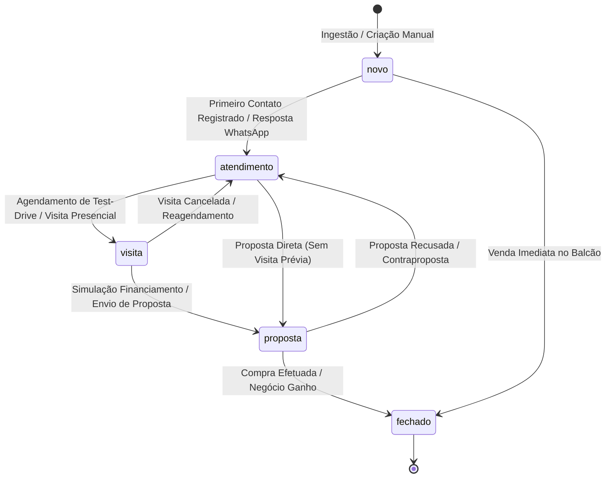
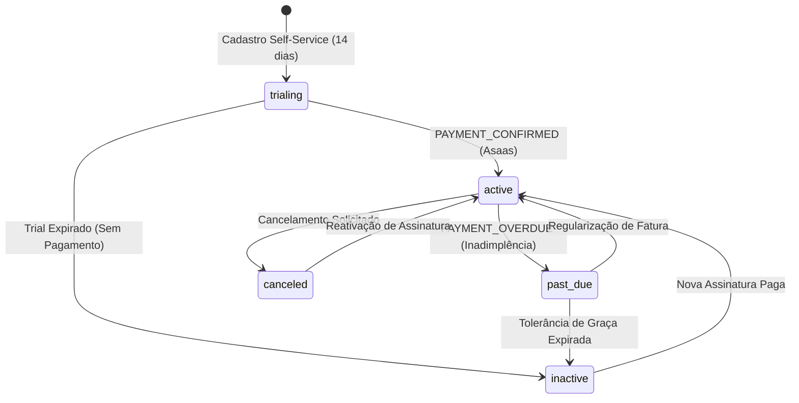
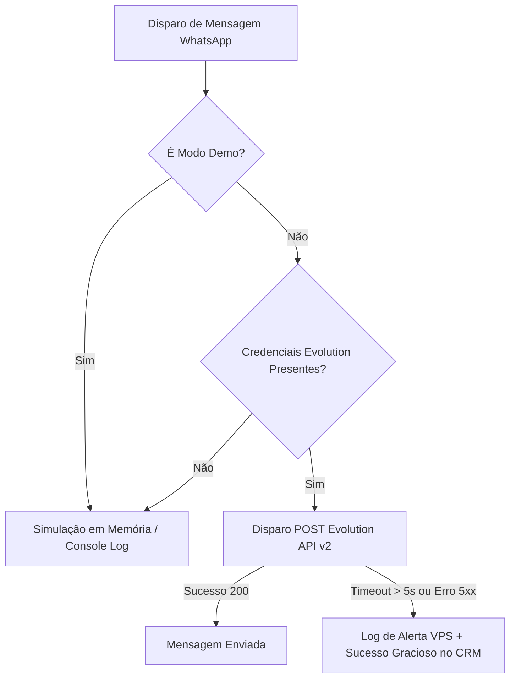

# Especificação de Regras de Negócio — Acelera Auto CRM

> **Documento de Requisitos de Negócio (BRD) & Especificação Funcional**  
> **Versão:** 1.0.0  
> **Status:** Aprovado para Engenharia & QA  
> **Classificação:** Documento Técnico Canônico de Domínio  

---

## 1. Glossário e Domínio

A tabela abaixo define formalmente os termos, entidades, conceitos operacionais e sinônimos utilizados no código-fonte, banco de dados e interfaces do sistema.

| Termo | Definição | Sinônimos no Código | Contexto de Uso |
|---|---|---|---|
| **Tenant / Organização** | Unidade lógica e jurídica de isolamento de dados que representa uma concessionária ou revenda de veículos. | `organization`, `organizations`, `orgId`, `tenant_id`, `hostOrg` | Isolamento relacional de todas as tabelas via RLS e chaves estrangeiras. |
| **Lead** | Oportunidade de negócio gerada por uma pessoa física ou jurídica interessada na compra, venda ou troca de veículo. | `lead`, `leads`, `LeadRow`, `KanbanLead` | Entidade central do funil de vendas, processamento de webhooks e distribuição comercial. |
| **Roleta Comercial** | Mecanismo algorítmico determinístico de distribuição *round-robin* de leads entre consultores de vendas ativos e escalados. | `roleta`, `lead-roulette`, `roundRobinCursor`, `leadRouting` | Distribuição automática de leads recebidos via webhook ou API sem corretor pré-atribuído. |
| **Plantão / In Roulette** | Estado operacional temporário que indica se o consultor de vendas está apto a receber novos leads no momento do disparo. | `in_roulette`, `is_online`, `onDuty`, `roulette_status` | Filtro booleano aplicado aos perfis antes da seleção do próximo beneficiário na roleta. |
| **Cockpit do Gestor** | Painel analítico executivo que consolida indicadores operacionais, volumetria, gargalos de atendimento e valores negociados. | `cockpit`, `manager-cockpit`, `dashboard/reports` | Visualização estratégica exclusiva para papéis com permissão gerencial ou administrativa. |
| **Dinheiro na Mesa** | Indicador financeiro consolidado que soma o valor estimado dos veículos de interesse de todos os leads ativos no funil. | `moneyOnTable`, `dinheiroNaMesa`, `pipelineValue` | Métrica dinâmica do Cockpit calculada em tempo real com base no campo `leads.value`. |
| **Evolution API v2** | Gateway de mensageria externa via protocolo HTTP REST acoplado ao motor WhatsApp Web/Baileys. | `evolution`, `evolutionApi`, `whatsapp-client` | Disparo automático de alertas para vendedores e sincronização de instâncias QR Code. |
| **Instância WhatsApp** | Sessão dedicada de WhatsApp vinculada a uma organização específica através de identificador canônico `org_{id}`. | `whatsapp_instances`, `instanceName`, `instance` | Pareamento via QR Code, monitoramento de conectividade (`open`, `close`, `connecting`). |
| **Asaas** | Instituição de pagamento e infraestrutura de liquidação de faturamento via Pix, Boleto e Cartão de Crédito. | `asaas`, `asaas-webhook`, `subscription-service` | Gestão de assinaturas recorrentes do CRM, cobranças, upgrade de planos e conciliação. |
| **Modo Demonstração** | Ambiente *sandbox* em memória e sem persistência em banco real, utilizado para demonstrações comerciais e testes guiados. | `isDemo`, `acelera_demo_mode`, `DEFAULT_DEMO_ORG_ID` | Proteção absoluta de produção com renderização imediata de dados sintéticos sem latência. |
| **Período de Graça** | Janela temporal de tolerância pós-vencimento de assinatura (`past_due`) em que o acesso ao CRM não é revogado. | `PAST_DUE_GRACE`, `warning: true` | Prevenção de paralisação imediata da loja por atrasos bancários transitórios. |
| **SDR (Sales Rep)** | Pré-vendedor responsável pela qualificação preliminar de contatos antes do repasse ao consultor de fechamento. | `sdr`, `qualificador` | Papel operacional com acesso restrito a leads em estágios iniciais de atendimento. |

---

## 2. Atores e Perfis de Acesso (RBAC)

O sistema adota controle de acesso baseado em papéis (*Role-Based Access Control* - RBAC), complementado por políticas de segurança a nível de linha de banco (*Row Level Security* - RLS).

```
                      +-------------------+
                      |    SuperAdmin     | (Plataforma Global)
                      +---------+---------+
                                |
                      +---------v---------+
                      |   Admin / Owner   | (Concessionária)
                      +---------+---------+
                                |
                      +---------v---------+
                      |  Gerente / Gestor | (Operação / Equipe)
                      +---------+---------+
                                |
                      +---------v---------+
                      | Vendedor / Consult| (Funil Próprio)
                      +---------+---------+
                                |
                      +---------v---------+
                      |        SDR        | (Triagem / Qualificação)
                      +-------------------+
```

### 2.1. Matriz de Autorização por Funcionalidade

| Funcionalidade / Recurso | SuperAdmin | Admin / Dono | Gerente | Vendedor | SDR | Sistema / Webhook |
|---|:---:|:---:|:---:|:---:|:---:|:---:|
| **Acesso a Múltiplos Tenants (Global)** | SIM | NÃO | NÃO | NÃO | NÃO | NÃO |
| **Gestão de Plano e Faturamento (Asaas)** | SIM | SIM | NÃO | NÃO | NÃO | NÃO |
| **Gerenciamento de Chaves de API (`api_keys`)** | SIM | SIM | NÃO | NÃO | NÃO | NÃO |
| **Conexão de Instância WhatsApp (QR Code)** | SIM | SIM | SIM | NÃO | NÃO | NÃO |
| **Gestão de Equipe (Convidar, Excluir, Roleta)** | SIM | SIM | SIM | NÃO | NÃO | NÃO |
| **Exclusão de Outro Administrador/Owner** | SIM | NÃO | NÃO | NÃO | NÃO | NÃO |
| **Visualização Panorâmica de Todos os Leads** | SIM | SIM | SIM | NÃO | NÃO | SIM (escopo da chave) |
| **Visualização de Leads Próprios (Atribuídos)** | SIM | SIM | SIM | SIM | SIM | NÃO |
| **Movimentação de Cards no Kanban** | SIM | SIM | SIM | SIM (próprios) | SIM (próprios) | NÃO |
| **Cadastro e Edição de Veículos no Estoque** | SIM | SIM | SIM | SIM | NÃO | SIM (escopo da chave) |
| **Exportação de Relatórios Executivos (CSV/PDF)** | SIM | SIM | SIM | NÃO | NÃO | NÃO |
| **Ingestão Externa de Leads (Endpoints v1)** | NÃO | NÃO | NÃO | NÃO | NÃO | SIM (com Bearer / Key) |

### 2.2. Restrições Estritas de Papéis

1. **Proteção Inviolável do Proprietário:** Perfis com `role: "admin"` ou identificados como proprietários da organização não podem ter seus registros excluídos ou rebaixados por gerentes ou outros administradores via interface gráfica ou endpoints convencionais.
2. **Escopo Estrito do Vendedor:** Usuários com `role: "vendedor"` (`seller`) que consultarem endpoints REST (`/api/v1/leads`) ou telas do Kanban recebem obrigatoriamente um filtro automático `seller_id = auth.uid()`. Tentativas de acessar ou alterar leads de outros consultores devem resultar em erro `403 Forbidden`.
3. **Escopo de Máquina (Webhooks & Chaves de API):** Chaves geradas em `api_keys` pertencem unicamente a um `organization_id`. Toda operação autenticada via `x-api-key` está restrita ao tenant associado, sendo proibida a leitura ou escrita transversal.

---

## 3. Máquinas de Estados (Lifecycle dos Recursos Centrais)

### 3.1. Ciclo de Vida do Lead (`leads.status`)

Estados permitidos: `novo`, `atendimento`, `visita`, `proposta`, `fechado`.



#### Tabela de Transições de Estado do Lead

| Estado Origem | Gatilho / Evento | Estado Destino | Condição / Guarda |
|---|---|---|---|
| `*` (Inexistente) | Ingestão via API / Webhook / Manual | `novo` | Payload validado com telefone e nome válidos. |
| `novo` | Registro de mensagem ou clique no card | `atendimento` | Atribuído a um vendedor válido. |
| `atendimento` | Agendamento confirmado na agenda | `visita` | Data e horário da visita informados. |
| `visita` | Visita não concretizada | `atendimento` | Registro de justificativa em observações. |
| `visita` | Emissão de cálculo financeiro | `proposta` | Veículo de interesse definido e valor válido. |
| `atendimento` | Envio de proposta sem visita | `proposta` | Venda remota ou negociação digital. |
| `proposta` | Pagamento/Sinal aprovado | `fechado` | Confirmação de venda pelo vendedor ou gestor. |
| `proposta` | Reprovação de crédito ou desistência | `atendimento` | Mantém lead em nutrição comercial. |

- **Transições Explicitamente Proibidas:**
  - `fechado` $\rightarrow$ `novo`: Negócio já encerrado não pode retornar ao início do funil como lead recém-chegado. Exige criação de novo registro de lead caso o cliente inicie nova jornada de compra.

---

### 3.2. Ciclo de Vida da Organização & Assinatura (`organizations.subscription_status`)

Estados permitidos: `trialing`, `active`, `past_due`, `canceled`, `inactive`.



#### Tabela de Transições de Assinatura

| Estado Origem | Gatilho / Evento | Estado Destino | Condição / Guarda |
|---|---|---|---|
| `*` (Inexistente) | Submissão de Cadastro (`registerNewDealership`) | `trialing` | Organização criada sem convite associado; `trial_ends_at = now + 14d`. |
| `trialing` | Webhook `PAYMENT_CONFIRMED` ou `PAYMENT_RECEIVED` | `active` | Confirmação de transação recebida do Asaas; `plan = 'pro'`. |
| `trialing` | Transcurso de 14 dias sem assinatura | `inactive` | `Date.now() > trial_ends_at`. Bloqueio de rotas pelo Guard. |
| `active` | Webhook `PAYMENT_OVERDUE` | `past_due` | Fatura pendente além do vencimento; concede período de graça. |
| `past_due` | Webhook `PAYMENT_RECEIVED` | `active` | Baixa bancária confirmada pelo Asaas; estende `current_period_end`. |
| `past_due` | Limite do período de tolerância ultrapassado | `inactive` | Falha continuada de conciliação; paywall ativado. |
| `active` | Webhook `PAYMENT_DELETED` ou `PAYMENT_REFUNDED` | `inactive` | Estorno financeiro registrado no gateway. |

---

### 3.3. Ciclo de Vida de Convite de Membro (`organization_invites.status`)

Estados permitidos: `pending`, `accepted`, `revoked`, `expired`.

| Estado Origem | Gatilho / Evento | Estado Destino | Condição / Guarda |
|---|---|---|---|
| `*` | Convite disparado pelo Gestor em `/team` | `pending` | E-mail corporativo válido; vagas disponíveis no plano (`current < max`). |
| `pending` | Primeiro login do usuário com senha definida | `accepted` | Token validado ou e-mail correspondente autenticado no Supabase Auth. |
| `pending` | Gestor clica em "Excluir / Revogar" na tela de equipe | `revoked` | Apenas administrador ou gerente pode revogar. |
| `pending` | Transcurso de 7 dias (168h) sem aceite | `expired` | `Date.now() > expires_at`. Link torna-se inválido para autenticação. |

- **Transições Explicitamente Proibidas:**
  - `accepted` $\rightarrow$ `pending`: Convite já aceito não pode ser revertido para pendente. Exige envio de novo convite.
  - `revoked` $\rightarrow$ `accepted`: Convite revogado administrativamente não pode ser validado por link previamente gerado.

---

### 3.4. Ciclo de Vida da Instância WhatsApp (`whatsapp_instances.status`)

Estados permitidos: `disconnected`, `connecting`, `connected`.

| Estado Origem | Gatilho / Evento | Estado Destino | Condição / Guarda |
|---|---|---|---|
| `*` / `disconnected` | Clique em "Conectar WhatsApp" na tela de ajustes | `connecting` | Instância criada na Evolution API v2 com QR Code gerado em base64. |
| `connecting` | Leitura do QR Code pelo smartphone do gestor | `connected` | Evento `connection.update` reportando `state: 'open'`. |
| `connected` | Logout pelo celular ou desconexão forçada na VPS | `disconnected` | Evento `connection.update` reportando `state: 'close'`. |
| `connecting` | Timeout de leitura do QR Code (2 minutos) | `disconnected` | Falha na captura do webhook de pareamento. |

---

## 4. Catálogo Detalhado de Regras de Negócio (Por Módulo)

---

### Módulo: Multi-tenancy & Onboarding (TEN)

#### RN-TEN-001: Auto-Provisionamento Condicional de Tenant Trial no Registro Self-Service
- **Descrição:** Permite que novos lojistas se cadastrem na plataforma recebendo automaticamente um tenant isolado com 14 dias de teste gratuito.
- **Atores Elegíveis:** Visitante anônimo na página `/register`.
- **Pré-condições:** O e-mail e telefone informados não devem possuir conta prévia no Supabase Auth nem convites pendentes na organização de terceiros.
- **Gatilho (Trigger):** Submissão do formulário na rota `/register` chamando a Server Action `registerNewDealership`.
- **Critérios e Lógica de Processamento:**
  1. Validar campos com Zod: `fullName`, `email`, `phone`, `password` (mínimo 6 caracteres), `storeName`.
  2. Criar usuário no Supabase Auth com metadados: `full_name`, `dealership_name`, `store_name`, `phone`.
  3. Gerar slug alfanumérico único derivado de `storeName` sanitizado, acrescido de sufixo aleatório de 4 a 5 caracteres.
  4. Inserir registro em `organizations` via `createAdminClient()` com:
     - `plan = 'trial'`
     - `subscription_status = 'trialing'`
     - `trial_ends_at = now() + interval '14 days'`
  5. Inserir registro em `profiles` vinculando `id = user.id`, `organization_id = newOrg.id`, `role = 'admin'`.
  6. Limpar cookies de sessão de demonstração (`clearDemoCookiesAction`).
- **Pós-condições (Sucesso):** Organização criada, usuário autenticado e redirecionado para `/leads`.
- **Tratamento de Exceção / Falha:**
  - *Condição de Erro:* Falha ao inserir em `profiles` após criação da organização.
  - *Comportamento do Sistema:* Executa *rollback* cirúrgico deletando a organização recém-criada e removendo o usuário recém-registrado do Supabase Auth.
  - *Código / Mensagem de Erro:* `500 - Erro ao associar perfil administrativo: [detalhe]`.

---

#### RN-TEN-002: Herança Estrita de Tenant para Vendedores Convidados
- **Descrição:** Garante categoricamente que vendedores e colaboradores convidados via link de convite ou e-mail herdem o `organization_id` da loja convidante e **NUNCA** criem uma nova concessionária duplicada no banco de dados.
- **Atores Elegíveis:** Vendedor / Consultor convidado.
- **Pré-condições:** Registro prévio existente na tabela `organization_invites` com o e-mail do colaborador ou metadados de autenticação contendo `organization_id`.
- **Gatilho (Trigger):** Primeiro acesso pós-definição de senha, autenticação via `/auth/callback` ou chamada a `resolveUserTenantContext()`.
- **Critérios e Lógica de Processamento:**
  1. No carregamento do contexto do usuário (`resolveUserTenantContext`), verificar existência de registro em `profiles`.
  2. Se `!profile || !profile.organization_id`, inspecionar:
     a) `user.user_metadata?.organization_id`
     b) Consulta na tabela `organization_invites` por `email = user.email` e `status = 'pending'`.
  3. Se localizado `inheritedOrgId`:
     - Confirmar a existência do tenant na tabela `organizations`.
     - Fazer upsert do perfil em `profiles` com `organization_id = hostOrg.id`, `role = (invite.role || 'vendedor')`.
     - Atualizar o convite em `organization_invites` para `status = 'accepted'`.
     - Retornar o contexto com `organizationId = hostOrg.id` e `needsOnboarding = false`.
     - **Interromper e PROIBIR a execução de qualquer rotina de criação em `organizations`.**
  4. Se o usuário possuir papel de vendedor (`seller`/`vendedor`) e não possuir convite associado, marcar `needsOnboarding = true` e retornar `organizationId = null`.
- **Pós-condições (Sucesso):** Vendedor integrado à concessionária correta sem poluição da tabela `organizations`.
- **Tratamento de Exceção / Falha:**
  - *Condição de Erro:* Organização anfitriã inexistente ou deletada.
  - *Comportamento do Sistema:* Define `organizationId = null` e `needsOnboarding = true`, orientando contato com o suporte.
  - *Código / Mensagem de Erro:* `404 - Concessionária de origem não localizada`.

---

#### RN-TEN-003: Isolamento Lógico de Consultas e Operações por `organization_id`
- **Descrição:** Estabelece que toda e qualquer leitura, mutação ou exclusão de dados em produção deve ser delimitada pelo identificador do tenant autenticado.
- **Atores Elegíveis:** Todas as requisições autenticadas da aplicação.
- **Pré-condições:** Sessão válida resolvida via JWT de usuário ou chave de API de máquina.
- **Gatilho (Trigger):** Qualquer Server Action, query REST ou chamada de serviço.
- **Critérios e Lógica de Processamento:**
  1. Em consultas via cliente de usuário (`createServerSupabaseClient`), o RLS do PostgreSQL filtra automaticamente por `organization_id = (SELECT organization_id FROM profiles WHERE id = auth.uid())`.
  2. Em consultas via cliente administrativo (`createAdminClient`), o código TypeScript DEVE injetar explicitamente o filtro `.eq("organization_id", tenantContext.organizationId)`.
  3. É proibido omitir a cláusula `.eq("organization_id", ...)` em operações de escrita administrativa que alterem tabelas de domínio (`leads`, `vehicles`, `clients`, `api_keys`).
- **Pós-condições (Sucesso):** Dados isolados sem risco de vazamento cruzado (*cross-tenant data leakage*).
- **Tratamento de Exceção / Falha:**
  - *Condição de Erro:* `tenantContext.organizationId` ausente ou nulo em requisição de produção.
  - *Comportamento do Sistema:* Bloqueia a execução imediatamente e retorna zero state ou erro de autenticação.
  - *Código / Mensagem de Erro:* `401 - Não autenticado / Tenant não identificado`.

---

### Módulo: Roleta Comercial & Distribuição (ROL)

#### RN-ROL-001: Elegibilidade Estrita para Roleta Comercial
- **Descrição:** Determina quais colaboradores da equipe estão aptos a receber um novo lead no momento do processamento da roleta.
- **Atores Elegíveis:** Motor da Roleta (`resolveAssignedSellerInfo`).
- **Pré-condições:** Organização real com colaboradores cadastrados.
- **Gatilho (Trigger):** Ingestão de lead sem vendedor explicitamente atribuído.
- **Critérios e Lógica de Processamento:**
  1. Consultar todos os perfis associados ao `organization_id` da loja.
  2. Filtrar os candidatos que cumpram simultaneamente:
     a) Papel operacional compatível: `role` igual a `'vendedor'`, `'gerente'` ou `'admin'`.
     b) Status de plantão ativo: `in_roulette === true` (ou sem valor booleano falso explícito).
     c) Flag de status em tempo real: `is_online !== false` no banco de dados.
     d) Não possuir bloqueio de ausência registrado em cookie ou store de memória (`ROULETTE_STATUS_COOKIE`).
  3. Se nenhum vendedor cumprir todos os critérios, acionar a regra de fallback [RN-ROL-004].
- **Pós-condições (Sucesso):** Lista de consultores aptos preparada para ordenação.
- **Tratamento de Exceção / Falha:**
  - *Condição de Erro:* Lista vazia de vendedores elegíveis.
  - *Comportamento do Sistema:* Encaminha para o gestor titular ou proprietário da loja.
  - *Código / Mensagem de Erro:* Log informativo: `[Roleta] Nenhum consultor elegível. Encaminhando para administrador.`

---

#### RN-ROL-002: Algoritmo Round-Robin Determinístico com Cursor
- **Descrição:** Seleciona um único consultor entre os elegíveis seguindo alternância cíclica (*round-robin*), garantindo distribuição equitativa.
- **Atores Elegíveis:** Motor da Roleta (`resolveAssignedSellerInfo`).
- **Pré-condições:** Lista com ao menos 1 consultor elegível.
- **Gatilho (Trigger):** Conclusão da filtragem de elegibilidade da RN-ROL-001.
- **Critérios e Lógica de Processamento:**
  1. Ordenar a lista de vendedores elegíveis por ordem alfabética de nome (`full_name ASC`) para estabilidade determinística da matriz.
  2. Calcular o índice do destinatário: `targetIndex = roundRobinCursor % activeSellers.length`.
  3. Incrementar o cursor global da organização: `roundRobinCursor = roundRobinCursor + 1`.
  4. Extrair o consultor selecionado: `selectedSeller = activeSellers[targetIndex]`.
  5. Registrar log estruturado no console do servidor:  
     `console.log('[Roleta] Consultor selecionado:', selectedSeller.name, 'Telefone:', selectedSeller.phone);`
- **Pós-condições (Sucesso):** Nome, ID e telefone do consultor resolvidos para injeção no lead.
- **Tratamento de Exceção / Falha:**
  - *Condição de Erro:* Erro no cálculo de array ou mutação concorrente.
  - *Comportamento do Sistema:* Fallback para o primeiro índice (`0`) da lista de elegíveis.

---

#### RN-ROL-003: Bypass da Roleta para Atribuição Explícita
- **Descrição:** Permite que leads direcionados especificamente a um vendedor (ex: carteira de clientes, atendimento presencial com cartão, lead de retorno) ignorem a roleta e sejam associados diretamente.
- **Atores Elegíveis:** Webhooks com payload parametrizado, gestor manual ou formulário do showroom.
- **Pré-condições:** O payload de entrada deve conter `seller_id` ou `seller_name` preenchido com valor significativo.
- **Gatilho (Trigger):** Recebimento do payload no endpoint `/api/v1/webhooks/leads`.
- **Critérios e Lógica de Processamento:**
  1. Sanitizar a entrada de `seller_id` e `seller_name`.
  2. Considerar como NÃO explícito se o valor for nulo, indefinido, vazio, ou strings reservadas: `"string"`, `"null"`, `"undefined"`, `"none"`, `"all"`, `"roleta"`, `"fila"`.
  3. Se o valor for uma string legítima diferente das reservadas:
     - Buscar vendedor na tabela `profiles` da organização com nome ou ID correspondente.
     - Se localizado, fixar a atribuição no vendedor indicado e ignorar o incremento do cursor da roleta.
- **Pós-condições (Sucesso):** Lead atribuído ao vendedor pré-definido sem alterar a vez dos demais na roleta.
- **Tratamento de Exceção / Falha:**
  - *Condição de Erro:* Vendedor explícito informado não pertence à organização.
  - *Comportamento do Sistema:* Desconsidera o vendedor fornecido e redireciona o lead para a Roleta Round-Robin padrão.
  - *Código / Mensagem de Erro:* Log informativo: `[Roleta] Vendedor explícito inválido para o tenant. Encaminhando para a roleta.`

---

#### RN-ROL-004: Fallback de Atribuição para Gestor Administrativo
- **Descrição:** Garante que nenhum lead permaneça desacompanhado caso todos os vendedores da concessionária estejam offline ou ausentes da roleta.
- **Atores Elegíveis:** Motor da Roleta.
- **Pré-condições:** 0 vendedores aptos na lista de plantão.
- **Gatilho (Trigger):** Avaliação de lista vazia de elegíveis em RN-ROL-001.
- **Critérios e Lógica de Processamento:**
  1. Buscar na tabela `profiles` o primeiro usuário com `role = 'admin'` vinculado ao tenant.
  2. Caso exista, extrair seu nome e telefone e atribuir o lead a ele.
  3. Caso não exista perfil administrativo com telefone, atribuir o nome institucional da loja ou `"Equipe de Vendas"`.
  4. Disparar notificação de contingência via WhatsApp para o telefone do gestor alertando que a roleta está desprovida de consultores no momento da chegada do lead.
- **Pós-condições (Sucesso):** Lead registrado com status `novo` e sob supervisão da gestão.

---

### Módulo: Ingestão de Leads & Webhooks (ING)

#### RN-ING-001: Autenticação de Webhooks via Hash SHA-256 de Chave de API
- **Descrição:** Protege os endpoints de ingestão contra injeção maliciosa e acesso não autorizado utilizando chaves criptográficas com verificação rápida em hash.
- **Atores Elegíveis:** Servidores de portais externos (Meta, Webmotors, OLX, Landing Pages, Zapier, n8n).
- **Pré-condições:** Chave de API previamente gerada pelo gestor na tela de configurações (`api_keys`).
- **Gatilho (Trigger):** Requisição HTTP POST para `/api/v1/webhooks/leads` ou `/api/v1/leads/ingest`.
- **Critérios e Lógica de Processamento:**
  1. Extrair token do header `x-api-key` ou `Authorization: Bearer <token>`.
  2. Se ausente, rejeitar com `401 Unauthorized`.
  3. Calcular o hash criptográfico do token recebido: `crypto.createHash('sha256').update(token.trim()).digest('hex')`.
  4. Consultar a tabela `api_keys` por `key_hash` idêntico.
  5. Verificar se `revoked_at` é nulo e se `expires_at` é nulo ou superior a `now()`.
  6. Extrair o `organization_id` proprietário da chave e utilizá-lo como o tenant canônico da operação.
  7. Atualizar de forma assíncrona `last_used_at = now()`.
- **Pós-condições (Sucesso):** Requisição autenticada e escopo do tenant resolvido.
- **Tratamento de Exceção / Falha:**
  - *Condição de Erro:* Token inexistente, revogado ou expirado.
  - *Comportamento do Sistema:* Rejeição imediata sem processamento do payload.
  - *Código / Mensagem de Erro:* `401 - {"error": "Unauthorized", "message": "Chave de API inválida ou revogada"}`.

---

#### RN-ING-002: Normalização Canônica de Origens de Lead (`lead_origin`)
- **Descrição:** Normaliza variações de nomenclatura de canais de marketing e tráfego recebidos em payloads externos para o enum restrito do banco de dados.
- **Atores Elegíveis:** Parser de Leads (`normalizeLeadOrigin`).
- **Pré-condições:** String de origem fornecida no payload (ex: `source`, `origin`, `canal`).
- **Gatilho (Trigger):** Processamento inicial de qualquer lead via webhook ou API.
- **Critérios e Lógica de Processamento:**
  - Mapear a string recebida (case-insensitive, sem acentos e sem espaços) conforme a matriz:
    - `"meta"`, `"meta_ads"`, `"facebook"`, `"instagram"`, `"face"` $\rightarrow$ `"instagram"`
    - `"site"`, `"landing_page"`, `"portal"` $\rightarrow$ `"site"`
    - `"webmotors"`, `"wm"` $\rightarrow$ `"webmotors"`
    - `"icarros"` $\rightarrow$ `"icarros"`
    - `"olx"` $\rightarrow$ `"olx"`
    - `"whatsapp"`, `"zap"` $\rightarrow$ `"whatsapp"`
    - `"telefone"`, `"ligacao"` $\rightarrow$ `"telefone"`
    - `"patio"`, `"balcao"`, `"presencial"` $\rightarrow$ `"patio_balcao"`
    - `"indicacao"`, `"amigo"` $\rightarrow$ `"indicacao"`
    - `"indicacao_dono"` $\rightarrow$ `"indicacao_dono"`
    - `"carteira"`, `"cliente_antigo"` $\rightarrow$ `"cliente_carteira"`
    - Qualquer outra entrada não reconhecida $\rightarrow$ fallback padrão `"site"`.
- **Pós-condições (Sucesso):** Campo `origin` compatível com o enum do PostgreSQL.

---

#### RN-ING-003: Deduplicação e Atualização de Leads Recorrentes
- **Descrição:** Impede que múltiplos cliques do mesmo cliente em um curto intervalo criem cards duplicados no funil, mantendo o histórico unificado.
- **Atores Elegíveis:** Serviço de Ingestão de Leads.
- **Pré-condições:** Telefone sanitizado no formato E.164.
- **Gatilho (Trigger):** Inserção de lead no endpoint `/api/v1/webhooks/leads`.
- **Critérios e Lógica de Processamento:**
  1. Buscar no banco de dados se já existe lead cadastrado na mesma organização com o mesmo número de telefone nos últimos **30 dias**.
  2. Se existir lead em status ativo (`novo`, `atendimento`, `visita`, `proposta`):
     - Atualizar o registro existente com:
       - `last_contact_at = now()`
       - Append no campo `notes`: `"[Novo interesse em {data} via {origem}: Veículo {veiculo}]"`
       - Se o novo lead possuir novo veículo de interesse, atualizar `vehicle_interest`.
     - **Não criar um novo card no Kanban.**
     - Disparar notificação via WhatsApp para o consultor já responsável alertando sobre o reengajamento do cliente.
  3. Se não existir lead ativo ou se o lead anterior estiver no status `fechado`, criar novo registro no status `novo` e acionar a Roleta Comercial.
- **Pós-condições (Sucesso):** Funil sem duplicações, histórico consolidado.

---

### Módulo: Mensageria & WhatsApp Evolution API v2 (WPP)

#### RN-WPP-001: Sanitização e Normalização E.164 de Telefones
- **Descrição:** Garante que todos os números de telefone manipulados para envio de WhatsApp atendam com rigor ao padrão internacional sem caracteres inválidos.
- **Atores Elegíveis:** Função de sanitização `formatWhatsAppNumber`.
- **Pré-condições:** String de telefone fornecida por formulário, banco ou webhook.
- **Gatilho (Trigger):** Toda rotina de disparo de mensagem ou validação de lead.
- **Critérios e Lógica de Processamento:**
  1. Remover todos os caracteres não numéricos: `digits = phone.replace(/\D/g, '')`.
  2. Se a string resultante estiver vazia, retornar string vazia imediata.
  3. Se o número possuir 10 dígitos (DDD + 8 dígitos iniciando entre 6 e 9):
     - Injetar o nono dígito: `9` após o DDD.
     - Prefixar o código do país: `55` (ex: `47988887777` $\rightarrow$ `55479988887777`).
  4. Se o número possuir 11 dígitos (DDD + 9 dígitos):
     - Prefixar o código do país: `55` (ex: `11999998888` $\rightarrow$ `5511999998888`).
  5. Se o número já começar com `55` e possuir 12 ou 13 dígitos, manter intacto.
  6. Para números internacionais (outros DDIs), aceitar comprimentos entre 10 e 15 dígitos.
  7. Se o número não atender a essas condições, rejeitar o disparo.
- **Pós-condições (Sucesso):** Número sanitizado pronto para entrega à Evolution API.

---

#### RN-WPP-002: Despacho Automático de Alerta de Novo Lead para o Consultor
- **Descrição:** Envia uma notificação formatada e imediata via WhatsApp para o smartphone do consultor assim que um lead é atribuído a ele pela roleta.
- **Atores Elegíveis:** Ação pós-atribuição (`notifyAssignedSellerViaWhatsApp`).
- **Pré-condições:** Consultor atribuído com telefone válido cadastrado no perfil e gateway WhatsApp configurado ou em modo simulação.
- **Gatilho (Trigger):** Conclusão bem-sucedida da ingestão de um lead.
- **Critérios e Lógica de Processamento:**
  1. Obter o telefone sanitizado do consultor destinatário.
  2. Construir o template de texto institucional:
     ```text
     🚗 *NOVO LEAD RECEBIDO - ACELERA AUTO* 🚗

     *Cliente:* {leadName}
     *Telefone:* {leadPhone}
     *Interesse:* {vehicleInterest}
     *Origem:* {origin}

     ⚡ *Ação Rápida:* Responda em menos de 5 minutos para maximizar as chances de fechamento!
     ```
  3. Identificar a instância do tenant: `instanceName = "org_" + organizationId.replace(/-/g, "_")`.
  4. Enviar requisição POST para a Evolution API v2:
     - Endpoint: `{EVOLUTION_API_URL}/message/sendText/{instanceName}`
     - Headers: `{"apikey": EVOLUTION_API_KEY, "Content-Type": "application/json"}`
     - Body: `{"number": formattedPhone, "text": messageText}`
  5. Timeout da chamada: exatamente **5.000 milissegundos (5 segundos)** via `AbortController`.
- **Pós-condições (Sucesso):** Mensagem enviada e logada com ID retornado pelo gateway.
- **Tratamento de Exceção / Falha:**
  - *Condição de Erro:* VPS offline, timeout de 5 segundos excedido ou erro HTTP 4xx/5xx da Evolution API.
  - *Comportamento do Sistema:* Não quebra a transação de criação do lead. Loga o erro estruturado no console (`console.error('[WhatsApp API] Erro ao conectar na VPS:', error)`) e conclui a Server Action com sucesso no lead.
  - *Código / Mensagem de Erro:* Log: `[WhatsApp Warning] Falha na entrega do WhatsApp. Lead preservado no banco.`

---

#### RN-WPP-003: Resolução Resiliente de Credenciais e Fallback de Simulação
- **Descrição:** Garante que o sistema funcione de ponta a ponta sem lançar exceções mesmo se o gateway de mensageria não estiver parametrizado no ambiente.
- **Atores Elegíveis:** Helper `getWhatsAppCredentials` e `sendWhatsAppMessage`.
- **Pré-condições:** Nenhuma.
- **Gatilho (Trigger):** Toda chamada de envio de mensagem.
- **Critérios e Lógica de Processamento:**
  1. Resolver URL do gateway com prioridade: `process.env.EVOLUTION_API_URL || process.env.WHATSAPP_API_URL`.
  2. Resolver chave com prioridade: `process.env.EVOLUTION_API_KEY || process.env.WHATSAPP_API_KEY || process.env.WHATSAPP_API_TOKEN`.
  3. Se estiver em Modo Demo (`isDemo === true` ou tenant demo) OU se as credenciais estiverem ausentes:
     - Executar em modo Simulação/Log.
     - Imprimir o conteúdo no terminal com tag `[WhatsApp Service - Simulação]`.
     - Retornar `{ success: true, simulated: true, mode: "simulation", messageId: "mock_msg_..." }`.
  4. Se estiver em produção com credenciais válidas, efetuar a chamada HTTP real.
- **Pós-condições (Sucesso):** Execução garantida sem quebra de pipeline.

---

### Módulo: Gestão de Equipe & Capacidade (EQU)

#### RN-EQU-001: Validação Estrita do Limite de Vagas da Organização (`max_sellers`)
- **Descrição:** Bloqueia a inclusão de novos vendedores quando a concessionária atinge a cota contratada no plano, exibindo gatilho de upgrade.
- **Atores Elegíveis:** Gestor / Administrador ao convidar membro em `/team`.
- **Pré-condições:** Concessionária autenticada.
- **Gatilho (Trigger):** Submissão do modal de convite (`inviteSellerAction` ou `inviteTeamMemberAction`).
- **Critérios e Lógica de Processamento:**
  1. Contar o número de membros ativos na organização:
     `currentSellers = count(profiles WHERE organization_id = orgId AND role IN ('vendedor', 'gerente'))`.
  2. Obter o limite do plano atual (`max_sellers`):
     - Plano Starter: máximo **5 vendedores**.
     - Plano Pro: máximo **15 vendedores**.
     - Plano Enterprise: customizado / ilimitado.
  3. Se `currentSellers >= max_sellers`:
     - **Bloquear a criação do convite.**
     - Retornar `{ success: false, requiresUpgrade: true, error: "Limite de vagas de vendedores atingido para o seu plano." }`.
  4. Se `currentSellers < max_sellers`, prosseguir com a emissão do convite.
- **Pós-condições (Sucesso):** Vaga consumida e convite emitido.
- **Tratamento de Exceção / Falha:**
  - *Condição de Erro:* Cota excedida.
  - *Comportamento do Sistema:* Abre o modal de Upgrade para o Plano Pro via WhatsApp ou checkout Asaas.

---

#### RN-EQU-002: Ciclo de Convite, Transferência e Preservação de Histórico
- **Descrição:** Regula a adição de novos vendedores e a transferência de consultores já cadastrados entre concessionárias parceiras.
- **Atores Elegíveis:** Gestor da concessionária destinatária.
- **Pré-condições:** E-mail do vendedor informado no formulário.
- **Gatilho (Trigger):** Execução de `inviteSellerAction`.
- **Critérios e Lógica de Processamento:**
  1. Verificar se o e-mail já existe na tabela `profiles`.
  2. **Caso o usuário JÁ EXISTA:**
     - Verificar se já pertence à mesma organização: se sim, rejeitar com `"Este vendedor já faz parte da sua equipe"`.
     - Se pertencer a outra loja: gerar convite com `token` único em `organization_invites` e enviar e-mail via Resend alertando sobre o convite de transferência.
     - Ao aceitar o convite, atualizar o `organization_id` do perfil do vendedor e registrar o encerramento do vínculo anterior em `organization_members` com status `'transferred'`.
  3. **Caso o usuário NÃO EXISTA (Novo Cadastro):**
     - Inserir registro pendente na tabela `organization_invites`.
     - Invocar `supabaseAdmin.auth.admin.inviteUserByEmail(cleanEmail, { data: { full_name, organization_id, role, phone }, redirectTo })`.
- **Pós-condições (Sucesso):** Convite oficial do Supabase Auth e link de contingência gerados.

---

### Módulo: Faturamento & Assinaturas Asaas (FAT)

#### RN-FAT-001: Autenticação Criptográfica do Webhook do Asaas
- **Descrição:** Garante que apenas o gateway oficial do Asaas consiga notificar eventos de pagamento e alterar o status de faturamento das lojas.
- **Atores Elegíveis:** Servidores do Asaas via webhook HTTP POST em `/api/v1/webhooks/asaas`.
- **Pré-condições:** Variável de ambiente `ASAAS_WEBHOOK_SECRET` configurada no `.env.local` e replicada na Vercel.
- **Gatilho (Trigger):** Notificação recebida na rota `/api/v1/webhooks/asaas`.
- **Critérios e Lógica de Processamento:**
  1. Extrair token do header `asaas-access-token` ou `Asaas-Access-Token` (case-insensitive) aplicando `.trim()`.
  2. Resolver o segredo esperado no servidor com prioridade:
     `process.env.ASAAS_WEBHOOK_SECRET || process.env.ASAAS_ACCESS_TOKEN || process.env.ASAAS_WEBHOOK_TOKEN`.
  3. Comparar o token recebido com o token esperado.
  4. Se divergente, rejeitar imediatamente a requisição sem ler o body.
- **Pós-condições (Sucesso):** Autenticação validada e payload encaminhado ao `webhook-service`.
- **Tratamento de Exceção / Falha:**
  - *Condição de Erro:* Token divergente ou ausente.
  - *Comportamento do Sistema:* Retorna `401 Unauthorized`.
  - *Código / Mensagem de Erro:* `401 - {"error": "Unauthorized", "message": "Token do webhook ausente ou inválido"}`.

---

#### RN-FAT-002: Ativação Automática do Plano Pro via Webhook
- **Descrição:** Atualiza a organização para plano ativo e pago assim que o Asaas confirma a liquidação de uma assinatura.
- **Atores Elegíveis:** Webhook do Asaas.
- **Pré-condições:** Evento com tipo `PAYMENT_CONFIRMED` ou `PAYMENT_RECEIVED` e `targetOrgId` resolvido.
- **Gatilho (Trigger):** Execução do handler de eventos em `src/lib/services/asaas/webhook-service.ts`.
- **Critérios e Lógica de Processamento:**
  1. Extrair `targetOrgId` de `payment.externalReference` ou consulta por `customer`/`subscription`.
  2. Calcular `periodEnd` baseado em `subscription.nextDueDate` ou `payment.dueDate` (+30 dias como fallback).
  3. Atualizar a tabela `organizations` via `createAdminClient()` contendo **estritamente as colunas existentes**:
     ```typescript
     await supabaseAdmin
       .from('organizations')
       .update({
         subscription_status: 'active',
         plan: 'pro',
         plan_tier: 'pro',
         plan_status: 'active',
         trial_ends_at: null,
         current_period_end: periodEnd,
         updated_at: new Date().toISOString()
       })
       .eq('id', targetOrgId);
     ```
  4. **Proibição:** É proibido enviar propriedades inexistentes como `payment_method` na query do Supabase para evitar falhas de schema cache.
- **Pós-condições (Sucesso):** Concessionária ativada com acesso ilimitado liberado no Subscription Guard.

---

### Módulo: Modo de Demonstração / Sandbox (DEM)

#### RN-DEM-001: Proteção Absoluta de Produção e Isolamento do Modo Demo
- **Descrição:** Garante que o ambiente de demonstração funcione sem conexão de banco de dados e sem contaminar as tabelas reais de produção.
- **Atores Elegíveis:** Usuário visitante ou avaliador navegando com cookie `acelera_demo_mode = true` ou em tenant demo.
- **Pré-condições:** Nenhuma.
- **Gatilho (Trigger):** Toda interação com o sistema.
- **Critérios e Lógica de Processamento:**
  1. Se `tenantContext.isDemo === true`:
     - Toda mutação (criar lead, arrastar no Kanban, cadastrar veículo, convidar membro) opera exclusivamente sobre estruturas em memória (`memoryTeamMembers`, `mockLeads`, `mockVehicles`).
     - **É TERMINANTEMENTE PROIBIDO** executar inserts, updates ou deletes no Supabase real para o ID `a0000000-0000-0000-0000-000000000001`.
  2. Se a sessão for de **PRODUÇÃO** (`!tenantContext.isDemo`):
     - **É TERMINANTEMENTE PROIBIDO** exibir dados de fixtures fictícias (ex: `"Roberto Silva"`, `"Juliana Costa"`, `"R$ 1.480.000"`).
     - O sistema deve exibir zero state legítimo (`0 leads`, `R$ 0,00`) quando o lojista real ainda não cadastrou dados.
- **Pós-condições (Sucesso):** Demonstração fluida sem poluição de dados reais.

---

## 5. Regras de Integração e Resiliência

### 5.1. Políticas de Retry e Backoff

| Serviço Integrado | Limite Máximo de Tentativas | Intervalo Inicial | Fator de Backoff | Jitter | Ação após Esgotamento |
|---|:---:|:---:|:---:|:---:|---|
| **Evolution API v2 (WhatsApp)** | 2 tentativas | 1.000 ms | 2.0 | Sim (±20%) | Log de falha estruturado; lead é preservado no banco sem interrupção do funil. |
| **Asaas API (Checkout/Billing)** | 3 tentativas | 2.000 ms | 2.0 | Sim (±10%) | Retorna erro amigável ao usuário solicitando nova tentativa ou contato com suporte. |
| **Resend (SMTP de Convites)** | 2 tentativas | 1.500 ms | 2.0 | Não | Gera link de contingência imediato na tela (`fallbackInviteLink`) para cópia manual. |

### 5.2. Dead Letter Queues (DLQ) e Falhas Críticas de Webhooks

1. **Payloads Rejeitados por Validação:** Requisições POST enviadas a `/api/v1/webhooks/leads` que violem o schema Zod (ex: telefone malformado, nome vazio) são rejeitadas com `422 Unprocessable Entity` e gravadas em log com prefixo `[DLQ-VALIDATION-ERROR]` contendo o timestamp, IP de origem e payload bruto para auditoria.
2. **Webhooks com Tenant Não Encontrado:** Se um webhook do Asaas ou portal automotivo referenciar uma organização inexistente no banco, o endpoint retorna `200 OK` contendo `{"received": true, "actionTaken": "skipped_organization_not_found"}`. Essa abordagem evita loops infinitos de reenvio por parte dos servidores emissores.

### 5.3. Roteamento de Mensageria e Fallback Gracioso



---

## 6. Validação e Sanitização de Dados

A tabela abaixo consolida as regras atômicas de validação implementadas via Zod em toda a aplicação.

| Entidade | Campo | Tipo | Obrigatório? | Regra de Formato / Validação | Mensagem de Rejeição |
|---|---|:---:|:---:|---|---|
| **Lead** | `name` | String | SIM | Mínimo 2 caracteres, sem caracteres de controle. | `"O campo 'name' deve ter no mínimo 2 caracteres."` |
| **Lead** | `phone` | String | SIM | Padrão brasileiro: DDD (2) + 8 ou 9 dígitos (10 a 13 dígitos numéricos). | `"Número de telefone ou WhatsApp inválido. Forneça DDD + número."` |
| **Lead** | `email` | String | NÃO | Formato de e-mail RFC 5322 válido caso informado. | `"Formato de e-mail inválido."` |
| **Lead** | `origin` | String | NÃO | Enum canônico `LeadOrigin`. Default: `"site"`. | `"Origem de lead inválida."` |
| **Lead** | `vehicle_interest`| String | NÃO | Texto descritivo com no máximo 150 caracteres. | `"Identificação de veículo excede o tamanho permitido."` |
| **Veículo** | `make` | String | SIM | Mínimo 2 caracteres (ex: "Toyota", "Volkswagen"). | `"Marca do veículo é obrigatória."` |
| **Veículo** | `model` | String | SIM | Mínimo 1 caractere (ex: "Corolla", "Gol"). | `"Modelo do veículo é obrigatório."` |
| **Veículo** | `year_fab` | Number | SIM | Ano entre 1950 e ano corrente + 1. | `"Ano de fabricação inválido."` |
| **Veículo** | `year_model` | Number | SIM | Ano de modelo entre `year_fab` e `year_fab + 1`. | `"Ano do modelo incompatível com o ano de fabricação."` |
| **Veículo** | `price` | Number | SIM | Valor em centavos ou decimal positivo maior que zero. | `"Preço do veículo deve ser maior que zero."` |
| **Veículo** | `plate_last_digits`| String | SIM | Exatamente 4 caracteres alfanuméricos finais da placa. | `"Informe os 4 dígitos finais da placa."` |
| **Equipe** | `email` | String | SIM | E-mail corporativo válido contendo `@` e `.`. | `"Informe um endereço de e-mail corporativo válido."` |
| **Equipe** | `role` | String | SIM | Valor entre `"admin"`, `"gerente"`, `"vendedor"`. | `"Papel de equipe inválido."` |
| **Auth** | `password` | String | SIM | Mínimo 6 caracteres alfanuméricos. | `"A senha deve ter no mínimo 6 caracteres."` |

---

## 7. Retenção, Privacidade e Compliance (LGPD)

1. **Anonimização e Expurgo de Leads:**
   - Dados de leads que permaneçam em status inativo ou sem interação comercial há mais de **24 meses** são elegíveis para anonimização irreversível dos campos `name`, `phone`, `email` e `notes`, mantendo apenas os dados agregados para estatísticas financeiras e volumétricas.
2. **Mascaramento de Logs de Produção:**
   - É terminantemente proibido imprimir em logs de servidores tokens secretos, headers de autenticação (`asaas-access-token`, `apikey`) ou senhas de usuários em texto plano.
   - Logs de depuração de webhook devem exibir apenas os primeiros 4 caracteres e o comprimento das credenciais (ex: `{ hasExpectedToken: true, expectedLength: 32 }`).
3. **Direito de Revogação de Acesso e Exclusão:**
   - A exclusão de um colaborador da equipe em `/team` desativa imediatamente o acesso do usuário no Supabase Auth via revogação de sessão, mantendo os registros históricos de vendas atribuídos ao nome do vendedor para não corromper o cálculo de comissões e métricas passadas.

---

## 8. Casos Extremos e Decisões Pendentes

- `[DECISÃO PENDENTE: Política de Excesso de Capacidade de Veículos]`
  - *Contexto:* Atualmente a validação de capacidade (`max_sellers`) incide exclusivamente sobre o número de consultores na equipe. Não há bloqueio implementado para número máximo de veículos cadastrados no estoque por plano.
  - *Ação Futura:* Definir se o Plano Starter deve possuir teto de estoque (ex: 50 veículos) ou manter estoque ilimitado em todos os planos pagos.

- `[DECISÃO PENDENTE: Janela Temporal Estrita do Período de Graça]`
  - *Contexto:* O status `past_due` concede acesso temporário (`PAST_DUE_GRACE`) sem corte imediato. No momento, o bloqueio definitivo para `inactive` é disparado pelo webhook `PAYMENT_DELETED` do Asaas ou cancelamento manual.
  - *Ação Futura:* Formalizar cron job para expirar automaticamente organizações em `past_due` há mais de 7 dias caso o Asaas não envie evento de baixa ou cancelamento.
