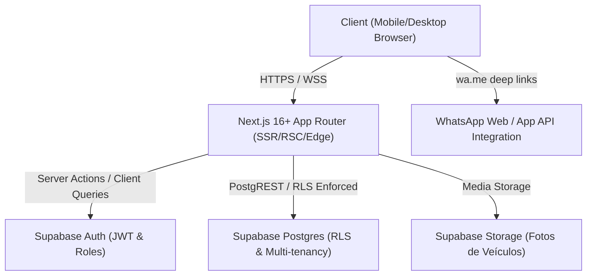
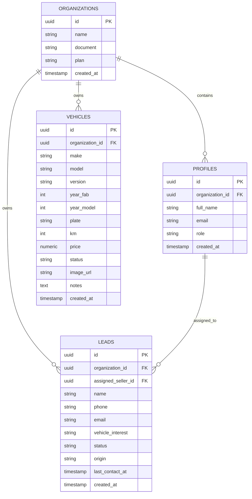

# Arquitetura Técnica — Acelera Auto CRM

> Documento de Referência Arquitetural, Design de Sistema e Guia de Engenharia

---

## 1. Visão Geral do Sistema

O **Acelera Auto CRM** é uma plataforma SaaS *mobile-first* construída para modernizar a operação comercial de revendas e concessionárias de veículos seminovos e novos no Brasil. A aplicação combina funil de vendas visual (Kanban), gestão ágil de estoque de veículos, disparo integrado de mensagens para WhatsApp e governança multi-tenant com segurança a nível de linha de banco de dados (Row Level Security).



---

## 2. Stack Tecnológica e Decisões de Arquitetura

| Camada | Tecnologia | Justificativa Arquitetural |
|---|---|---|
| **Framework Web** | **Next.js 16+ (App Router)** | Renderização híbrida (Server Components por padrão, Client Components apenas para nós interativos), rotas organizadas por domínios `(dashboard)`, performance extrema de Core Web Vitals e caching avançado. |
| **Linguagem** | **TypeScript 5 (Strict Mode)** | Tipagem estrita com `noImplicitAny`, zero uso de `any`, validação em tempo de compilação em todo o fluxo de dados (formulários, DTOs, entidades). |
| **Estilização** | **Tailwind CSS v4 + shadcn/ui** | Design System consistente, utilitários CSS atômicos, animações micro-interativas (`tw-animate-css`) e componentes acessíveis com Radix UI. |
| **Ícones & UX** | **lucide-react** | Pacote consistente e leve de ícones SVG otimizados para interface responsiva. |
| **Banco & Auth** | **Supabase (PostgreSQL 15+)** | Postgres nativo com suporte a JSONB, autenticação JWT robusta, Row Level Security (RLS) declarativo e triggers em PL/pgSQL. |
| **Qualidade & Testes** | **Vitest + Testing Library + v8** | Execução rápida de testes unitários e de integração em ambiente `jsdom`, com cobertura de código via v8 e mocks de navegador. |
| **CI/CD** | **GitHub Actions** | Esteira automatizada de build, type-check, lint e testes a cada push e pull request na branch `main`. |

---

## 3. Estrutura de Diretórios

```
acelera-auto-crm/
├── .github/
│   └── workflows/
│       └── ci.yml               # Pipeline de CI/CD automatizado
├── docs/
│   ├── technical-architecture.md # Este documento
│   ├── user-manual.md           # Manual de operação do usuário
│   └── qa/
│       └── test-plan.md         # Estratégia de QA e matriz de risco
├── src/
│   ├── __tests__/               # Suíte de testes automatizados
│   │   ├── integration/         # Testes de integração de componentes
│   │   ├── unit/                # Testes unitários de regras de negócio
│   │   └── setup.ts             # Configuração global do ambiente de teste
│   ├── app/                     # Next.js App Router
│   │   ├── (dashboard)/         # Grupo de rotas autenticadas do dashboard
│   │   │   ├── layout.tsx       # Shell responsivo (Sidebar + Mobile Sheet)
│   │   │   ├── leads/           # Funil Kanban de Vendas
│   │   │   │   └── page.tsx
│   │   │   └── vehicles/        # Gestão de Estoque
│   │   │       └── page.tsx
│   │   ├── globals.css          # Design tokens, variáveis CSS e Tailwind
│   │   ├── layout.tsx           # Root Layout (fontes, metadata global)
│   │   └── page.tsx             # Redirecionamento raiz (/) -> (/leads)
│   ├── components/              # Componentes modulares
│   │   ├── ui/                  # Componentes base (shadcn/ui primitivas)
│   │   └── vehicles/            # Componentes de domínio de veículos
│   │       ├── new-vehicle-modal.tsx # Modal de cadastro com preview
│   │       └── vehicle-card.tsx      # Card com ações rápidas e dropdown
│   ├── lib/                     # Utilitários e infraestrutura
│   │   ├── lead-utils.ts        # Regras puras de cálculo de tempo e WhatsApp
│   │   ├── mock-data.ts         # Camada de mock com dados automotivos
│   │   ├── supabase/            # Cliente e helpers do Supabase
│   │   │   └── client.ts
│   │   └── utils.ts             # Helper cn (clsx + tailwind-merge)
│   └── types/                   # Tipagem TypeScript centralizada
│       └── crm.ts               # Lead, Vehicle, Statuses, DTOs
├── package.json
├── tsconfig.json
└── vitest.config.ts
```

---

## 4. Modelo de Dados e Schema do Supabase

### 4.1 Diagrama Entidade-Relacionamento (DER)



### 4.2 Definição das Tabelas em SQL (PostgreSQL DDL)

```sql
-- Habilita extensão para geração de UUIDs
CREATE EXTENSION IF NOT EXISTS "uuid-ossp";

-- 1. Organizações (Lojas / Concessionárias)
CREATE TABLE organizations (
    id UUID PRIMARY KEY DEFAULT uuid_generate_v4(),
    name VARCHAR(255) NOT NULL,
    document VARCHAR(20) UNIQUE, -- CNPJ
    plan VARCHAR(50) DEFAULT 'pro',
    created_at TIMESTAMPTZ DEFAULT NOW()
);

-- 2. Perfis de Usuário (Vendedores / Gerentes)
CREATE TABLE profiles (
    id UUID PRIMARY KEY REFERENCES auth.users(id) ON DELETE CASCADE,
    organization_id UUID NOT NULL REFERENCES organizations(id) ON DELETE CASCADE,
    full_name VARCHAR(255) NOT NULL,
    email VARCHAR(255) NOT NULL,
    role VARCHAR(50) DEFAULT 'seller' CHECK (role IN ('admin', 'manager', 'seller')),
    created_at TIMESTAMPTZ DEFAULT NOW()
);

-- 3. Veículos do Estoque
CREATE TABLE vehicles (
    id UUID PRIMARY KEY DEFAULT uuid_generate_v4(),
    organization_id UUID NOT NULL REFERENCES organizations(id) ON DELETE CASCADE,
    make VARCHAR(100) NOT NULL,
    model VARCHAR(100) NOT NULL,
    version VARCHAR(150),
    year_fab INT NOT NULL CHECK (year_fab >= 1970),
    year_model INT NOT NULL CHECK (year_model >= year_fab),
    plate VARCHAR(10) NOT NULL,
    km INT NOT NULL DEFAULT 0 CHECK (km >= 0),
    price NUMERIC(12, 2) NOT NULL CHECK (price >= 0),
    status VARCHAR(30) NOT NULL DEFAULT 'disponivel' CHECK (status IN ('disponivel', 'reservado', 'vendido')),
    image_url TEXT,
    notes TEXT,
    created_at TIMESTAMPTZ DEFAULT NOW()
);

-- 4. Leads do Funil Comercial
CREATE TABLE leads (
    id UUID PRIMARY KEY DEFAULT uuid_generate_v4(),
    organization_id UUID NOT NULL REFERENCES organizations(id) ON DELETE CASCADE,
    assigned_seller_id UUID REFERENCES profiles(id) ON DELETE SET NULL,
    seller_name VARCHAR(255) NOT NULL,
    name VARCHAR(255) NOT NULL,
    phone VARCHAR(30) NOT NULL,
    email VARCHAR(255),
    vehicle_interest VARCHAR(255) NOT NULL,
    status VARCHAR(30) NOT NULL DEFAULT 'novo' CHECK (status IN ('novo', 'atendimento', 'visita', 'proposta', 'fechado')),
    origin VARCHAR(30) NOT NULL DEFAULT 'whatsapp' CHECK (origin IN ('whatsapp', 'instagram', 'site', 'indicacao', 'telefone', 'olx', 'icarros')),
    last_contact_at TIMESTAMPTZ,
    created_at TIMESTAMPTZ DEFAULT NOW()
);
```

---

## 5. Multi-Tenancy e Políticas de Segurança (Row Level Security - RLS)

Para garantir **isolamento absoluto** entre diferentes lojistas clientes da plataforma:

1. Todas as tabelas de negócio possuem a coluna `organization_id`.
2. A função `auth.jwt() -> app_metadata -> organization_id` é usada para inferir dinamicamente a loja à qual o usuário logado pertence.
3. As políticas RLS do PostgreSQL filtram automaticamente todas as operações `SELECT`, `INSERT`, `UPDATE` e `DELETE`.

```sql
-- Habilita RLS em todas as tabelas
ALTER TABLE organizations ENABLE ROW LEVEL SECURITY;
ALTER TABLE profiles ENABLE ROW LEVEL SECURITY;
ALTER TABLE vehicles ENABLE ROW LEVEL SECURITY;
ALTER TABLE leads ENABLE ROW LEVEL SECURITY;

-- Helper para obter organization_id da sessão ativa
CREATE OR REPLACE FUNCTION current_org_id() 
RETURNS UUID AS $$
  SELECT (auth.jwt() -> 'app_metadata' ->> 'organization_id')::UUID;
$$ LANGUAGE sql STABLE;

-- Políticas de isolamento para Veículos
CREATE POLICY "Tenant isolation for vehicles: SELECT" ON vehicles
    FOR SELECT USING (organization_id = current_org_id());

CREATE POLICY "Tenant isolation for vehicles: INSERT" ON vehicles
    FOR INSERT WITH CHECK (organization_id = current_org_id());

CREATE POLICY "Tenant isolation for vehicles: UPDATE" ON vehicles
    FOR UPDATE USING (organization_id = current_org_id());

CREATE POLICY "Tenant isolation for vehicles: DELETE" ON vehicles
    FOR DELETE USING (organization_id = current_org_id());

-- Políticas de isolamento para Leads
CREATE POLICY "Tenant isolation for leads: SELECT" ON leads
    FOR SELECT USING (organization_id = current_org_id());

CREATE POLICY "Tenant isolation for leads: INSERT" ON leads
    FOR INSERT WITH CHECK (organization_id = current_org_id());

CREATE POLICY "Tenant isolation for leads: UPDATE" ON leads
    FOR UPDATE USING (organization_id = current_org_id());

CREATE POLICY "Tenant isolation for leads: DELETE" ON leads
    FOR DELETE USING (organization_id = current_org_id());
```

---

## 6. Guia de Manutenção e Extensão do Código

### 6.1 Adicionando um Novo Módulo no Dashboard
1. Crie a pasta em `src/app/(dashboard)/<modulo>/page.tsx`.
2. Adicione a rota correspondente no array `navItems` em `src/app/(dashboard)/layout.tsx`.
3. Defina as interfaces em `src/types/crm.ts`.
4. Crie testes unitários para regras de negócio em `src/__tests__/unit/` e testes de componentes em `src/__tests__/integration/`.

### 6.2 Boas Práticas de TypeScript
- **Proibido usar `any`**: use tipos genéricos, uniões (`type Status = 'a' | 'b'`) ou `unknown` com asserções seguras.
- Centralize contratos de dados e DTOs em `src/types/crm.ts`.
- Mantenha funções utilitárias puras separadas dos componentes React para facilitar testes sem mocks complexos de DOM.
